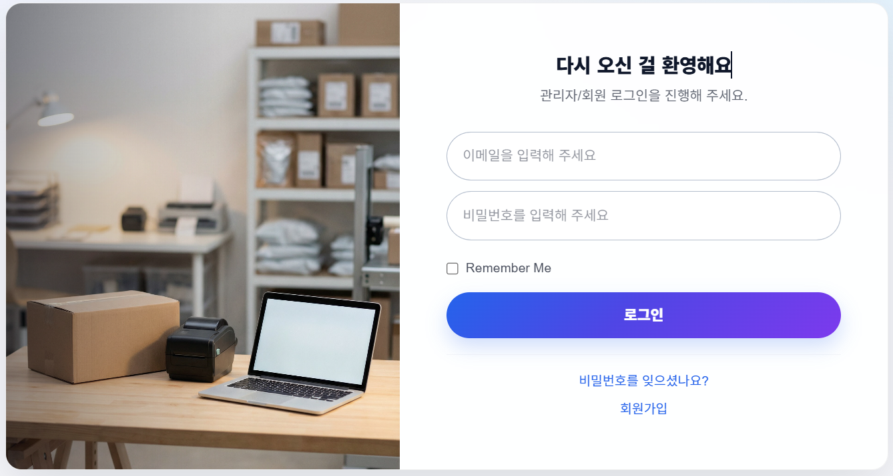
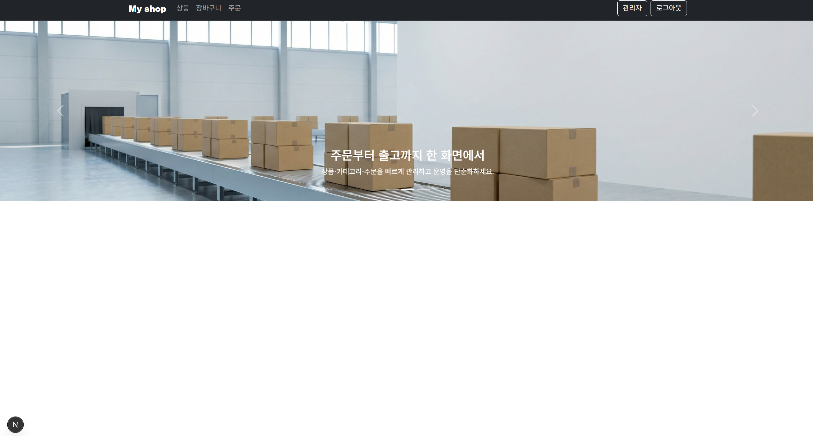
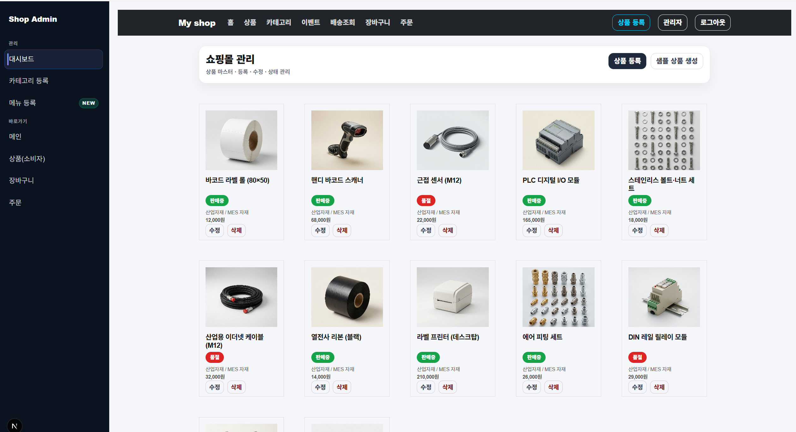

# 🏭 ERP · MES · SHOP 연계 쇼핑몰 BACKEND 프로젝트 (진행중)

> ERP–MES–SHOP 업무 흐름을 고려하여  
> **상품 · 주문 · 재고 · 출고 흐름을 처리하는 산업자재 쇼핑몰 백엔드** 개인 프로젝트입니다.  
>  
> ⚠️ 현재 ERP 기준정보 연계 및 MES 확장 구조 **고도화 진행중**입니다.

---

## 📌 프로젝트 개요

본 프로젝트는 단순한 쇼핑몰 API 구현이 아닌,  
실제 현업에서 사용되는 **ERP → SHOP → MES** 업무 흐름을  
**백엔드 관점에서 안정적으로 처리하기 위한 시스템 설계·구현**을 목표로 합니다.

- ERP 기준 상품 / 가격 / 카테고리 기준정보 관리
- SHOP 주문 요청 처리
- MES 재고·출고 연계를 고려한 확장 가능한 구조

---

## 🔐 인증 · 권한 처리

관리자 / 사용자 역할을 구분하여  
**JWT 기반 인증 및 권한 분리 구조**로 API 접근을 제어합니다.

- 관리자: 상품 마스터 관리, 판매 상태 제어
- 사용자: 상품 조회, 주문 처리

> 프론트엔드 로그인 화면과 연동되는 인증 API 구조입니다.

---

## 🛒 쇼핑몰 메인 API 흐름 (사용자)

ERP 기준정보를 기반으로  
쇼핑몰 메인 화면에 노출되는 **상품 조회 API**를 제공합니다.

### 처리 흐름
- 상품 목록 조회
- ERP 기준 상품명 / 가격 정보 응답
- 주문 진입을 위한 데이터 제공

---

## 🧑‍💼 관리자 상품 관리 API (ERP 성격)

관리자 화면에서 사용하는  
**상품 마스터 관리용 API**를 제공합니다.

### 제공 기능
- 상품 등록 / 수정 / 삭제 API
- 판매중 / 품절 상태 관리
- ERP 기준 정보 역할 수행

---

## 🔗 ERP · MES · SHOP 연계 관점 (백엔드)

- **ERP**
  - 상품 / 가격 / 카테고리 기준정보 관리 주체
- **SHOP**
  - 사용자 주문 처리 및 조회 API 제공
- **MES**
  - 재고 차감 · 출고 처리를 고려한 확장 구조 설계

> 현재는 SHOP 중심 백엔드 구조이며,  
> MES 재고·출고 연계는 단계적으로 확장 예정입니다.

---

## 🛠 기술 스택

- **Backend**
  - Java 17
  - Spring Boot
  - Spring Security + JWT
  - JPA (Hibernate)
  - REST API
- **DB**
  - RDB 기반 설계 (MariaDB / Oracle 고려)
- **Tooling**
  - Gradle
  - GitHub

---

## 📂 패키지 구조

(여기부터 작성)
